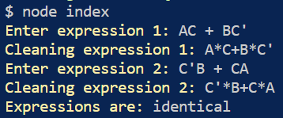
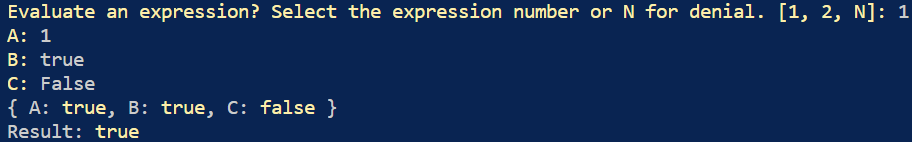
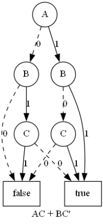
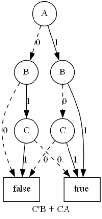

# Guide
## Pre-requisites
- You first need to install node.js locally
  - [Download](https://nodejs.org/en/download/)
- You then need to install graphviz locally  
  - Windows [Download](https://graphviz.org/download/#windows)
  - Linux [Download](https://graphviz.org/download/#linux)
## Setting path
You need to set the graphviz output path in the code by changing the following in **index.js** accordingly
```javascript
    g.setGraphVizPath("PATH/TO/GRAPHVIZ");
    g.output("png", "test01.png");
    visAns = await readUser(readVis);
```
* In windows, the path is: `C:\\Program Files\\Graphviz\\bin`  
* You can always check its location in the PATH environment variable in windows or by running the following command in any UNIX command line: ```which dot```

## Installation
You can install the project by running the command: `npm install` in the root directory of the project (where you can find package.json)

## Running locally
You can run the project by running the command: `node index` in the root directory of the project (where you can find index.js)

# Usage
1. When you run `node index`, you will be prompted to enter two boolean expressions.
2. After entering the expressions, the expressions will be cleaned and two trees will be constructed.
3. The trees will get compared to each other and an *identical* or *not identical* will be output.
   <kbd></kbd>
4. You will then get asked if you want to evaluate the expressions for certain values of the variables you have entered. Type 1 for evaluating expression 1 and 2 for expression 2. Type N for denying and moving to the next step.
   <kbd></kbd>
4. You will then get asked if you want to visualize the ROBDD of the expressions. Type 1 for evaluating expression 1 and 2 for expression 2. Type N for denying and exiting the program.
   - An image will be generated in the root directory with the name *test01.png*.
   - You can always customize the image filename in: [Setting Path](#setting-path)

Examples of the generated images
<p float="left">
  
   
</p>
